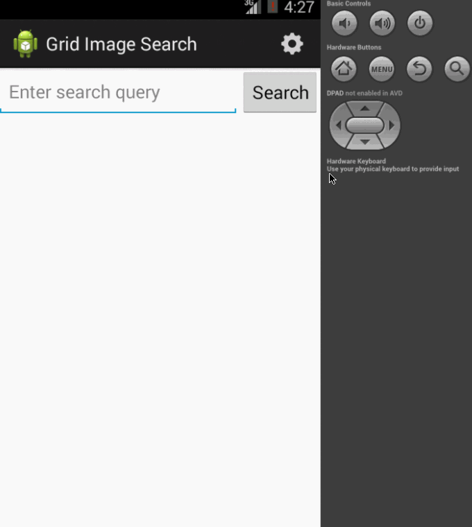
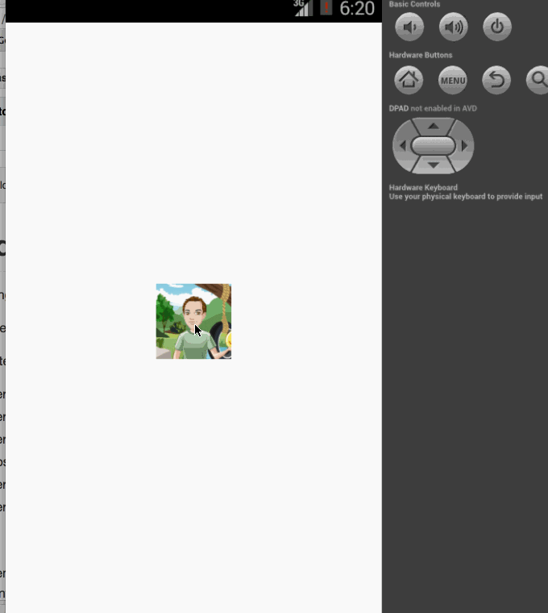

GridImageSearch
===============

App using Google search for images

Time spent: 3.5 hours spent in total

Completed user stories:

 * [x] User can enter a search query that will display a grid of image results from the Google Image API.
 * [x] User can click on "settings" which allows selection of advanced search options to filter results
 * [x] User can configure advanced search filters such as: size, color, type and site
 * [x] Subsequent searches will have any filters applied to the search results
 * [x] User can tap on any image in results to see the image full-screen
 * [x] User can scroll down “infinitely” to continue loading more image results (up to 8 pages) 
 * [x] Stretch: Use the StaggeredGridView to display visually interesting image results
 * [x] Stretch: User can zoom or pan images displayed in full-screen detail view
Notes:

* Spent some time going over understanding of how the endless scrolling works and working with spinners
* Went over the video/slides of the requisite material on the week2 assignment page

Walkthrough of all user stories:

GIF created with [LiceCap](http://www.cockos.com/licecap/)

